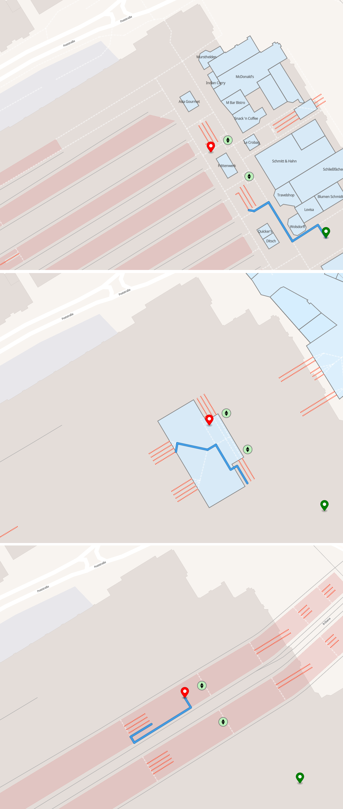
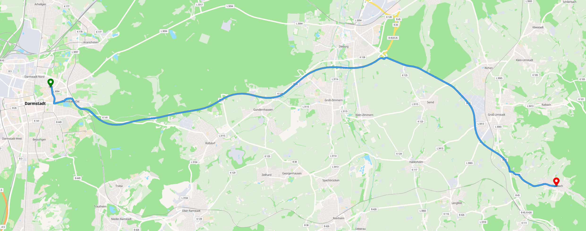
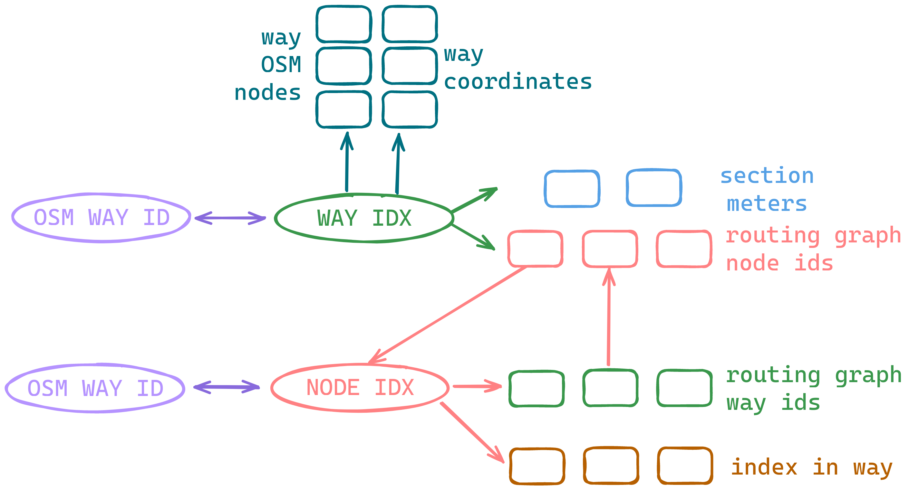

<p align="center"></p>

Demo (currently limited to 1h radius): https://osr.motis-project.de

# Open Street Router

This project is a *proof of concept* for planet wide street routing (pedestrian, bike, car, etc.) on OpenStreetMap. The
goal is to make it possible to import data on affordable low-end machines. This is mainly achieved by using compact data
structures and [memory mapped](https://en.wikipedia.org/wiki/Memory-mapped_file) files. A planet import should not need
more than 10GB of RAM. More RAM (and a fast SSD) will speed up the import. The reverse geocoding to map geo coordinates to the routing graph is currently required to be in memory. This is around 25 GB of memory for the whole planet during production use. In the future, a memory mapped version of the r-tree should be implemented and evaluated.

Directory with all created files after extract (all files can be memory mapped but it helps to lock routing data into memory):

```bash
# routing data 38.55G
# recommended to lock to memory
 22K multi_level_elevators.bin
8,5G node_in_way_idx_data.bin
6,4G node_in_way_idx_index.bin
542M node_properties.bin
 34M node_restricted.bin
4,7M node_restrictions_data.bin
1,1G node_restrictions_index.bin
8,5G node_ways_data.bin
6,4G node_ways_index.bin
748M way_node_dist_data.bin
1,7G way_node_dist_index.bin
2,3G way_nodes_data.bin
1,7G way_nodes_index.bin
625M way_properties.bin

# way osm nodes
 19G way_osm_nodes_data.bin
1,7G way_osm_nodes_index.bin

# way geometry
 19G way_polylines_data.bin
1,7G way_polylines_index.bin

# mapping to osm ids
2,2G node_to_osm.bin
1,7G way_osm_idx.bin
```

## Multi-Level Indoor Routing

<p align="center"></p>

## Car Outdoor Routing

<p align="center"></p>

## Usage

The PPR debug UI can be used for testing: https://github.com/motis-project/ppr/tree/master/ui/web

```bash
# --in     | -i     input file
# --out    | -o     output directory (will be deleted + created)
./osr-extract -i planet-latest.osm.pbf -o osr-planet

# --data   | -d     the output from osr-extract
# --static | -s     static HTML/JS/CSS assets to serve
./osr-backend -d osr-planet -s /path/to/ppr/ui
```

## Data Model

<p align="center"></p>

### Multi Nodes

The data model is not an explicit graph. Instead, the OpenStreetMap data (nodes and ways) is stored more or less as it
is. For routing purposes (i.e. finding shortest paths), only nodes are relevant that are part of more than one way.
Those nodes are given special IDs (`node_idx_t` in contrast to `osm_node_idx_t` which is the node index from
OpenStreetMap).

### Lookup

Since only a fraction of ways in OpenStreetMap are relevant for routing, we give the extracted ways internal
indices (`way_idx_t` in contrast to `osm_way_idx_t` which is the way index from OpenStreetMap). To be able to map
from `node_idx_t` to `osm_node_idx_t` and from `way_idx_t` to `osm_way_idx_t` and vice versa, we have a lookup table in
both directions.

### Way to Node and Node to Way

For routing, it's important to have a fast way to know which ways are reachable from which nodes and which nodes are
reachable from which way. To achieve this, we store for each `way_idx_t` a list of `node_idx_t` and for
each `node_idx_t` a list of `way_idx_t` coupled with the information which index this node has in the corresponding way.
If a node is part of a way multiple times, this mapping will contain the node multiple times. The order from the source
way in OpenStreetMap is maintained.

## Routing

Dijkstra`s algorithm with a time-based cutoff is used currently for routing.

### Node Neighborhood

For routing (here: Dijkstra's algorithm for now), it's necessary to know the neighborhood of a node. This can be looked
up by iterating all `way_idx_t` this node is contained in (see above) and the corresponding index `i` this node has in
the way. Neighbors are then node indices `i-1` and `i+1` in those ways. For the case that `i=0` or points to the last
index, `i-1` or `i+1` do not exist. With the definition of this neighborhood, the textbook version of Dijkstra's
algorithm can be applied.

### From Coordinate to Graph

To be able to resolve a geo coordinate into nodes in the graph for routing, a geo index data like a quad tree or r-tree
is required. As there are less `way_idx_t` than `node_idx_t`, we store the bounding boxes of all ways into the rtree. A
lookup gives us all `way_idx_t` in the area. Sorting those ways by perpendicular line distance from the query coordinate
to the way gives us the closes `way_idx_t` for start and destination. After that, the two closest routing nodes ("left"
and "right") on that `way_idx_t` can be initialized.

### Profiles

All attributes of the OpenStreetMap ways that are relevant for routing are packed into a compact struct. Distances
between routing nodes (i.e. `node_idx_t`) on a way are stored for fast access.
A `profile_edge_weight(distance, way_attributes, direction) -> duration` function then computes the edge weight for this
specific profile. In case of one-way streets or other ways that should not be used by a profile, the function can
return `kInfeasible` to indicate this case.

### Reconstruction

Reconstruction works as in the textbook version of Dijkstra's algorithm except for the first and last part of the path
which is not part of the routing "graph" (geo coordinate to first `node_idx_t` and last `node_idx_t` to the geo
coordinate).

## Future Work

This is only a first proof-of-concept. Many basic as well as advanced features can follow.

Known Issues:

- Routing performance can be improved
  - by using A* or bidirectional A* for one to one queries
  - explore preprocessing-based approaches: landmarks, arc flags, transit node routing, multi-level-dijkstra, etc.
- If source and target are mapped to the same way, the path should not be forced to go through routing nodes
- Consider the routing profile for initialization

Basic:

- Extract street names of ways for reconstruction.
- Reconstruct description of way for navigation (including street names)
- Turn restriction relations ([example](https://www.openstreetmap.org/relation/1654115), [example](https://www.openstreetmap.org/node/516914))
- Penalize u-turns

Advanced:

- Create a compact memory-mapped or serializable version of [rtree.c](https://github.com/tidwall/rtree.c)
- Enable routing algorithm to have weights for nodes, not just edges (e.g. elevators, street crossings, etc.)
- Incremental live update with OpenStreetMap change sets (should be doable as the data model is not far away from OSM)
- Exclusion zones as part of the routing query (e.g. for e-scooter routing)
- Time-dependent routing (consider traffic flow forecast and/or live traffic)
- Add height profile information to edges (relevant e.g. for bike routing) and use it in routing profiles
- Combined routing for sharing mobility (e.g. walk to e-scooter, ride e-scooter, walk to destination)
- `vehicle=destination` ([example](https://www.openstreetmap.org/way/61914850))
- Start heading + destination heading
- Make barriers / inaccessible nodes routing nodes (example: [way](https://www.openstreetmap.org/way/940718404), [node](https://www.openstreetmap.org/node/8712182900))
